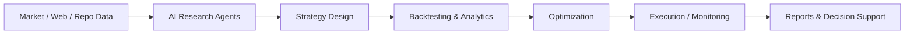

<h1 align="center">Jakub Janžo</h1>

<h3 align="center">
AI Engineer & Trader building agent workflows, quant research systems, and trading automation.
</h3>

  
  
  
  

  
  
  

---

## About Me

I am an **AI Engineer, automation builder, and trader** focused on building practical systems for research, execution, monitoring, and decision support.

My work sits at the intersection of:

- AI agents and automation
- Quantitative trading research
- Developer tooling
- Trading analytics
- Workflow orchestration
- Local-first productivity tools

I build systems that turn messy manual workflows into structured, automated pipelines.

I am currently open to **remote AI engineering roles, freelance automation projects, and trading/quant tooling work**.

---

## Tech Stack

  

  
  
  
  
  
  

---

## What I Build

I focus on systems that combine **AI, automation, and trading logic** into tools that are actually useful.

Examples:

- AI agent workflows
- Trading research pipelines
- Strategy development tools
- MT5 / trading platform utilities
- VS Code extensions
- Local monitoring dashboards
- Trading journals and analytics tools
- Automation scripts for repetitive technical work

---

## Featured Projects

  
  

  
  

---

## Project Highlights

### Agent Observatory

A VS Code dashboard for monitoring Claude Code, OpenCode, and Codex sessions locally.

**Built for:** AI developers running multiple coding agents and needing visibility into activity, idle states, session logs, and workflow status.

**Stack:** TypeScript, React, Node.js, VS Code API, local session logs.

---

### Trading Journal

A trading journal and analytics tool designed around MT5 workflows.

**Built for:** Tracking trades, reviewing performance, tagging strategies, analyzing equity curve, and improving trading decision quality.

**Stack:** Java, Swing, MQL5, trading analytics.

---

### NVIDIA Portfolio Analyst

A multi-agent stock portfolio analysis system using market data, risk metrics, and LLM reasoning.

**Built for:** Automated portfolio analysis, market research, risk review, and structured investment reports.

**Stack:** Python, pandas, NumPy, yfinance, NVIDIA NIM.

---

### OpenCode Notify Plugin

A lightweight notification plugin for OpenCode workflows.

**Built for:** Getting alerts when OpenCode is idle, needs permission, or requires user attention.

**Stack:** TypeScript, Bun, PowerShell.

---

## Current Focus

I am building an **AI Hedge Fund-style research and automation workflow**.

The goal is to automate more of the trading research process:

1. Collect research from papers, videos, GitHub, market data, and web sources  
2. Generate strategy ideas and variants  
3. Build and test trading systems  
4. Run optimization and robustness checks  
5. Produce structured reports and reusable code  
6. Improve the workflow with AI agents and automation tools  

This is not just a trading project. It is a full AI automation system for research, strategy development, and decision support.

---

## Core Skills

### AI & Automation

- AI agents
- LLM workflows
- Workflow orchestration
- Prompt engineering
- Research automation
- API integrations
- Local-first tools
- Developer productivity systems

### Trading & Quant Systems

- Algorithmic trading
- Strategy research
- Backtesting workflows
- Trading analytics
- MT5 / MQL5 tooling
- Pine Script
- NinjaScript
- Futures, FX, stocks, and crypto markets

### Software Engineering

- Python
- TypeScript
- Java
- React
- Node.js
- VS Code extensions
- Data pipelines
- Desktop applications
- Automation tooling

---

## GitHub Stats

  
  

---

## Contribution Streak

  

---

## Recent Activity

  

---

## Why Work With Me

I do not build generic AI demos.

I build practical tools that solve real workflow problems:

- reduce manual research time
- automate repetitive technical work
- improve trading analysis
- connect tools that normally do not talk to each other
- turn ideas into working internal software

My background is self-directed, practical, and execution-focused. I care about building systems that work, not just talking about technology.

---

## Open To

- Remote AI engineering roles
- Freelance AI automation work
- Trading and quant tooling projects
- Developer tooling projects
- Research automation systems
- Collaborations around AI agents, trading infrastructure, or workflow automation

---

## Contact

  
  
  

---

  <strong>AI automation. Quant systems. Trading tools. Developer workflows.</strong>

